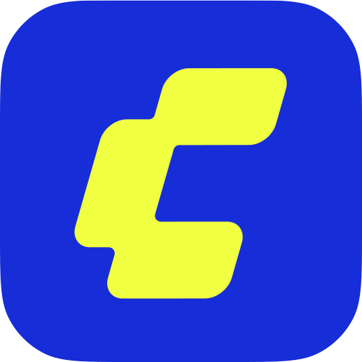

<p align="center">
  
</p>

<h1 align="center">Comfy Clicker</h1>

<p align="center">
  Click <b>Generate</b>. Buy GPUs. Quantize everything. Go viral.<br/>
  An incremental game for people who have opinions about VRAM.
</p>

---

## What it is

Comfy Clicker is an idle game. You start with a 4-core office PC
that can barely run SD 1.5. Every click on **Generate** earns a credit. Credits buy real hardware — a used RTX 3060,
a 4090 with a sagging connector, an RTX PRO 6000, then 8x H100 nodes, hyperscaler clusters and finally Comfy Cloud
regions — and every card you own earns credits per second and unlocks bigger models.

The twist is what you *spend* on:

- **Studio** — pay credits to generate content with a real model (SD 1.5, Flux, Qwen-Image, Wan 2.2, LTX-2…). The job runs
  on your hardware, gets posted to the in-game feed, and likes pay credits back. Video models pay more but need the VRAM.
- **Quantization** — FP8 and Q4 let a big model run on a smaller card, cheaper and faster, at a small quality cost.
  AMD cards are cheaper but need ROCm (and sometimes ZLUDA). Power draw is real: exceed your PSU and everything throttles.
- **Trending** — three hashtags trend every "week" (ten minutes), derived from what the real ComfyUI community is posting
  about right now. Match them in your prompt and the algorithm loves you. Spam them and it doesn't.
- **ComfyHub** — followers sign up, referral points multiply everything forever, and you can publish workflows other
  players run for royalties.
- **The Graph** — a node-graph progression map, ComfyUI style, with techniques (LoRA training, distillation), infrastructure
  (cooling, substations, reserved capacity), regions and prestige nodes.
- **Rebrand** — the prestige loop: reset the run, keep the map, earn Comfy Points.

Progress continues while you're away. Play as a guest or sign in to keep your save in the cloud, climb the leaderboard
and collect the daily login bonus.

## Stack

Next.js (App Router) · React 19 · TypeScript · Tailwind 4 · [Motion](https://motion.dev) · [Kokonut UI](https://kokonutui.com) ·
[@xyflow/react](https://reactflow.dev) · Supabase (auth, Postgres, RLS) · Vercel.

The game engine (`src/game`) is framework-free TypeScript with the balance tables in `src/data`, so tuning never touches
logic and everything is unit-tested with Vitest — including a pacing simulator (`pnpm balance`).

Art is generated with the [Comfy Cloud MCP](https://docs.comfy.org/agent-tools/mcp) from prompts in
`scripts/art-prompts.ts`; the UI ships designed fallbacks so nothing breaks while assets are missing.

## Playing it

- **Guest play** works instantly (localStorage). **Sign in** with email + password to keep the save in the cloud, appear on the leaderboard and collect the daily login bonus (server-timed streaks).
- **The Graph** (`/map`) is the progression map; **ComfyHub** (`/hub`) is where you publish workflows other players run — you earn royalties and rep, they get a likes boost.
- Hotkeys: `Space` generate, `S` save, `Esc` close. There are easter eggs. One of them involves a very famous key sequence.

## Development

```bash
pnpm install
cp .env.example .env.local   # Supabase keys are optional — the game runs fully offline as a guest
pnpm dev                     # http://localhost:3000
pnpm test                    # vitest
pnpm typecheck
pnpm balance                 # pacing simulation table
pnpm assets:check            # which generated assets are still missing
```

Deployment (Vercel + Supabase) is documented in [docs/DEPLOY.md](docs/DEPLOY.md); the UI contract lives in [docs/UI-SPEC.md](docs/UI-SPEC.md) and the engine contract in [src/game/CONTRACT.md](src/game/CONTRACT.md).

## Credits

Brand assets (logo, credits icon, vendor and node icons, palette, Inter) come from
[ComfyUI_frontend](https://github.com/Comfy-Org/ComfyUI_frontend). Real posts in the feed link to their authors on X and
LinkedIn. Not affiliated with any GPU vendor; the RTX 4090 connector jokes are our own.
